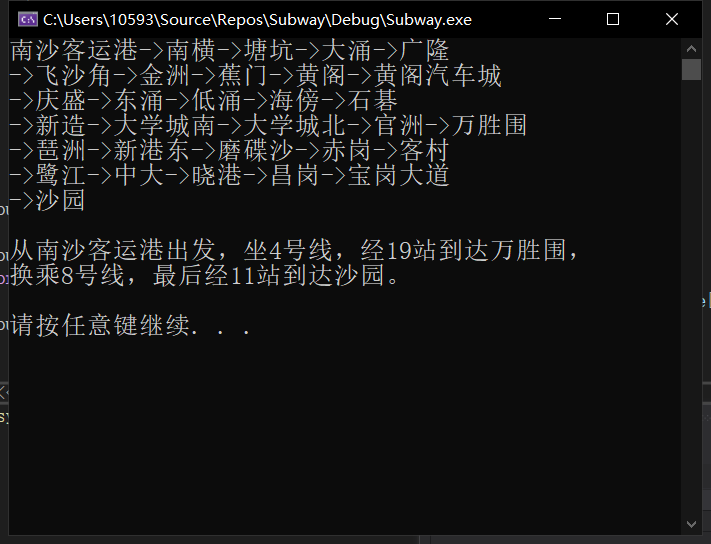
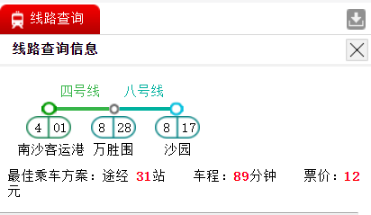
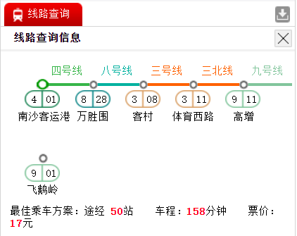

# 广州地铁查询系统

|学院|班级|姓名|学号|邮箱|
|:-:|:-:|:-:|:-:|:-:|
|数据科学与计算机学院|计算机类八班|张翊健|18340217|1059397226@qq.com|
|数据科学与计算机学院|计算机类八班|钟赫明|18340224|13216769194@qq.com|

## 摘要

## (1)引言

现在的地图软件（如高德地图和百度地图）在导航的时候，如果我们选择出行方式为地铁的话，这些软件通常都能为我们提供从起点站到终点站的最短路径。这次的实验我们将实现一个以广州地铁为基础数据的地铁寻路程序，能够让用户输入广州地铁中的起点站和终点站之后，输出从起点到终点的最优地铁乘坐路径，并根据实际统计数据给出预计的乘坐时间。

## (2)解决方法

### 2.1 数据处理

我们使用了同学分享的地铁线路数据，其中包含了（所在线路，起点，终点，所需时间）。每次运行初始化时，读取文件并处理这些数据。在这里，我们认为地铁查询系统应该关注时间，于是以时间作为边的权值。

要处理的问题有中转站问题，编号问题。

+ 对于中转站，我们通过添加后缀"1"，"2"，"3"，将之存储在站点集合中，并添加一条中转站之间权值为0的边。

  如"天河客运站"是3号线和6号线的中转站，于是在站点集合中，就有"天河客运站"和"天河客运站1"，边集中就有（"天河客运站"，"天河客运站1"，0）。

  这里需要注意，我们忽略了转站的时间，这是一个遗憾，因此，查询结果可能与官网查询结果有出入。

+ 为所有站点编号0，1，2，...，n-1，这样方便了查找最短路径的编程过程，也减小了边的存储开销，和关键字比较开销。

  此外，还需要创建一个从站点名到（编号，所在线路）的映射，同理，也需要通过编号迅速得到站点名。

  于是前者我们使用了`map<string, pair<string, int> >`，后者我们使用了`vector<string>`。

### 2.2 获取最短路径所用的数据结构

由于节点较多，我们采用了邻接表来存储边，在C++中，可以使用`vector<list<pair<int, int>>>`，这样对于顶点`u`，我们访问`E[u]`即可得到与u邻接的（顶点，距离）的链表`list<pair<int, int>>`。

求最短路径过程中，为每个点保存状态`(id, d, p, known, popped)`，其中，`id`为编号，`d`为起点到该点当前最短距离，`p`为最短路径的上一个顶点，`known`为是否已被访问过的标志，`popped`为是否已求出最短路径的标志。

### 2.3 算法设计细节

#### 关于最短路径算法的实现

	在实现了图的类之后，为了找出图中两个节点之间的最短路径，在类中添加一个最短路径函数：
``
vector<int> subway_system::shortest_path(int a, int b);
``

这个函数的参数为两个int类型，分别代表起点和终点的节点编号；返回值为int类型的vector，是从起点到终点的最短路径中，每个经过的点的编号。例如若从点1到点6的最短路径为1->5->2->4->6，则这个函数的返回值为

vector:1 5 2 4 6。

以上就是函数头所包含的信息。

接下来就是函数内部算法的实现。

由于之前的配合的问题，在图的类中没有对应节点的结构，而只有邻接表，所以在实现算法之前还需要先构建一个具有算法执行时需要信息的节点结构：

``
struct vertex {
	int id;
	int dis;
	int path;
	bool known;
	bool popped;
};
``

数据中，id代表着该节点在图中的编号，dis代表着在算法处理过程中当前该节点的最短“路”大小，path代表在遍历过程中该节点的父节点的编号。known代表着当前节点的dis是否已经被更新过；popped代表在算法执行过程中的“模拟优先队列”内，这个点是否已经被访问过并弹出。
整个算法的执行过程十分简单，在这里对于算法过程用自然语言进行简短的描述：
在由图中所有点构成的`vertex`数组中，如果还存在`popped`为`false`的点，就：
  
  选出`popped`为`false`的所有点中`dis`最小的点u
	对该点u的邻接表进行遍历，如果与该点u相邻的点v且`known`为`false`，则判断v当前的`dis`是否比该点u的`dis`和两点之间的边之和大，如是则更新其`dis`并将`known`改为真，并且将v的`path`用u的`id`赋值。

在算法结束后，从终点b开始，通过`path`属性一直找到a为止，并将中间经过的点全部放入要返回的vector中。
这样我们就得到了需要的最短路径。

#### 复杂度分析

##### 空间复杂度

邻接表占用空间$O(|E|)$，点状态占用空间$O(|V|)$，于是空间复杂度为$O(|E|+|V|)$.

##### 时间复杂度

每次顺序查找最近的点，故时间复杂度为$O(|E|+|V|^2)$.

## (3)程序使用和测试说明

### 编译与使用

本程序支持在`windows`环境下编译，如在`linux`环境下请发邮箱给本人以更换源代码(求求你做个人吧)

头文件有`subway.h`与`memu.h`，源文件有`main.cpp`、`subway.cpp`与`zyj.cpp`，数据文件有`srcdata`，将它们放在同一目录下，并使用合适的多文件编译器编译。

### 测试建议

打开广州地铁线路查询[广州地铁](https://github.com/learn-by-consciousness/subway/blob/master/www.gzmtr.com)，在右侧中部的线路查询系统中任选两个站点，在本程序中输入该两个节点，将所得结果与线路查询系统比较。

对于不同线路上的同名站，我们的边集中有权值为0的边将它们相连，这可能与实际情况中不符，即我们忽略了转站的时间，因此，查询结果可能与官网查询结果有出入。

对于中转站，我们通过添加后缀"1"，"2"，"3"，将之存储在站点集合中，并添加一条中转站之间权值为0的边。

这里需要注意，我们忽略了转站的时间，这是一个遗憾，因此，查询结果可能与官网查询结果有出入。

出现无法解决的问题请联系[3216769194@qq.com](mailto:3216769194@qq.com)或[1059397226@qq.com](mailto:1059397226@qq.com)

### 已进行的测试

1. 南沙客运港到沙园

   

   

2. 南沙客运港到飞鹅岭

   

   

## (4)总结和讨论

由之前的实现和测试可总结得，项目的核心算法还是Dijkstra算法求图中某两个节点之间的最短路径。在导入广州地铁的线路信息和乘坐时间的前提下，用该算法对导入的信息进行处理来完成整个项目的实现。由于这个项目本身具有实际的应用意义，所以我和我的伙伴关于该项目和实际应用中的实现的差别进行了讨论，同时探讨了该项目的实际应用价值。

众所周知，在很多导航程序、地铁信息网站中也有类似的地铁寻路功能，那么它们是如何实现的？是否和我们的项目一样是用Dijkstra最短路径算法实现的？经过我们的讨论之后，我们认为在实际的应用当中，对于类似的问题的处理应该不是通过最短路算法，而是通过直接获取已有的数据得到的。因为类似的地铁数据规模十分小，相比于直接导入最短路信息，应用算法的时间和空间开销不会比前者好多少，甚至前者还可以通过将数据同应用程序一起打包，或将数据放在网站后台数据库中，当用户需要时直接引用已有数据而不需要用算法去算出，这导致这种方法相比于使用算法在时间开销上更有优势。

于是这个问题也让我们想到了当前项目设计上的一个缺陷：对于多次相同的重复查询，每次都需要用最短路算法重新遍历整个地铁线网构成的图，毫无疑问这是低效的。如果，在程序实现上，对于每一次查询得到的数据都以程序执行缓存数据的形式保存下来，那么对于之前查询过的路线，在下一次查询的时候就可以直接调用缓存数据来获取结果而没有必要重新计算。虽然缓存数据会占用一些些存储空间，但是与多次重复执行算法带来的时间开销相比，这样做无疑是更优的。更何况这是当前其他成熟的项目都在使用的方法。

## (5)参考文献

### 鸣谢(以下排名不分先后)

张洪宾、张烨禧、张昊熹
